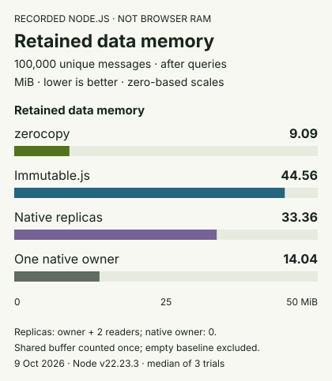
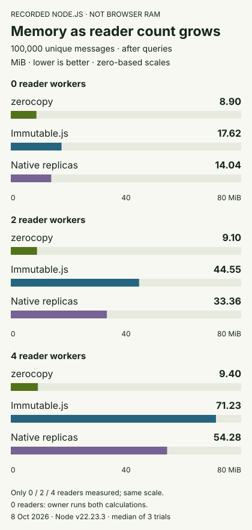
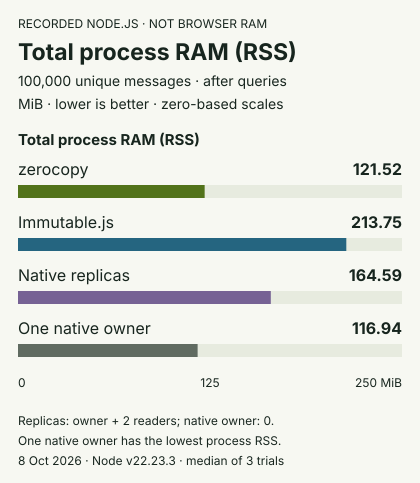

# Memory usage comparison

Memory is part of the performance result. A copy counter is not a memory measurement. Passing a startup test is not a memory comparison.

These are **recorded Node.js worker measurements**, not live measurements of your browser. The speed comparison uses Chromium and WebKit. Do not combine these memory figures with those timings as one browser result. Browser and physical iPhone RAM remain unmeasured here.

## Retained data memory

100,000 initial events. One data owner and two reader workers for Shared, Immutable.js and Native replicas. The one-owner control uses one native data owner with no reader replicas. All paths also have a small controller thread. Values are **MiB**, where 1 MiB = 1,048,576 bytes. Lower is better.

<!-- memory-chart:retained -->

<!-- /memory-chart -->

The table shows memory after two identical `request` search/summary operations. `vs Imm` means Immutable.js / Shared, and `vs Native` means native replicas / Shared. These are memory ratios, not speed ratios.

| Input | Shared | Immutable.js | vs Imm | Native replicas | vs Native | One native owner |
| --- | ---: | ---: | ---: | ---: | ---: | ---: |
| Repeated messages | 4.70 | 33.77 | 7.18x | 23.35 | 4.96x | 6.06 |
| Unique messages | 9.10 | 44.46 | 4.89x | 33.36 | 3.67x | 14.04 |
| Unique messages, 20% Unicode prefix | 9.79 | 46.65 | 4.77x | 35.86 | 3.66x | 14.88 |

This metric includes JavaScript objects, strings, read caches, tracked buffers, and the full current shared WASM buffer. It counts that WASM buffer **once**, not once per reader. It includes spare buffer space and arena history that is not reclaimed. It excludes the empty, imported worker baseline.

## Count all memory parts

For each architecture, the proof uses a fresh OS process. That process contains the controller, one owner, and every reader. It takes a baseline after imports and worker connections, before data loading. At each later sample, work and publication have stopped. Every thread runs four garbage-collection passes.

```text
Retained data memory =
  sum of post-GC JavaScript heap changes in all threads
  + sum of tracked ArrayBuffer changes in all threads
  + current capacity of each unique shared WASM memory, counted once
```

The proof records `external`, `arrayBuffers`, `heapUsed`, and RSS separately. It does not add `external` to `arrayBuffers`: that would count some memory twice. RSS is process-wide, so it is read once, not summed across workers. A separate calibration checks that this Node build tracks ordinary ArrayBuffers but does not already include shared WASM capacity in `arrayBuffers`. A changed accounting result fails the proof rather than silently changing the total.

Shared memory breakdown, after queries, in MiB:

| Input | JS heap increase, all threads | Unique WASM capacity | Arena allocation pointer, including header |
| --- | ---: | ---: | ---: |
| Repeated messages | 0.53 | 4.12 | 4.06 |
| Unique messages | 0.74 | 8.31 | 8.25 |
| Unique messages, 20% Unicode prefix | 1.31 | 8.44 | 8.40 |

Tracked auxiliary buffer changes are also in the totals. They are less than 0.05 MiB for these shared cases. The allocation pointer includes the 64 KiB arena header; it is not a measure of live payload only. The buffer capacity is the value added to the retained-memory total.

The configured maximum growth limit is **not** used memory. The proof counts `memory.buffer.byteLength`, not the configured maximum. It also does not claim to measure reserved virtual address space.

## More readers

Unique-message fixture, 100,000 events, after queries. All values are MiB. Zero readers means that the owner performs both calculations itself.

| Readers | Shared | Immutable.js | Native |
| --- | ---: | ---: | ---: |
| 0 | 8.90 | 17.48 | 14.04 |
| 2 | 9.10 | 44.46 | 33.36 |
| 4 | 9.41 | 71.12 | 54.28 |

<!-- memory-chart:readers -->

<!-- /memory-chart -->

The shared buffer remains the same size when more readers attach. Per-reader wrappers, compiled code and read caches still have a cost. The measured JavaScript cost grows; it is not zero. The native and Immutable.js designs retain separate data structures in each reader.

## Updates and old snapshots

Unique-message fixture. Two readers for replicated/shared designs. All values are MiB.

| State | Events | Shared | Immutable.js | Native replicas | One native owner |
| --- | ---: | ---: | ---: | ---: | ---: |
| Loaded, before queries | 100,000 | 8.82 | 44.23 | 33.19 | 15.75 |
| After two queries | 100,000 | 9.10 | 44.46 | 33.36 | 14.04 |
| Appended; old snapshot retained | 102,000 | 9.33 | 45.61 | 38.04 | 14.65 |
| Old snapshot released; query live | 102,000 | 9.39 | 45.64 | 38.09 | 14.71 |
| 20 more batches; latest view only | 142,000 | 12.58 | 62.52 | 47.57 | 21.11 |

Shared and Immutable.js retain actual old roots. The native append-only design retains a prefix length over its existing arrays. It is not charged for a needless full snapshot copy. Every old and live query is checked against an independent reference.

Dropping a shared root does not shrink its arena. The allocation and capacity figures remain unchanged between the retain and release stages. Small changes in JavaScript heap include cache state and measurement noise; they are not a leak diagnosis. No compaction runs in this workload. This benchmark does not test arbitrary edits, unbounded history, or long production sessions.

## Total process RAM is a different metric

Post-query **RSS**, in MiB. This is the whole Node process, including runtime code, all worker threads, heap pages, native allocations and shared backing. The startup baseline is not subtracted here. RSS can include free pages that the allocator has not returned to the operating system.

| Input | Shared | Immutable.js | Native replicas | One native owner |
| --- | ---: | ---: | ---: | ---: |
| Repeated messages | 107.57 | 181.20 | 142.29 | 88.15 |
| Unique messages | 122.06 | 212.99 | 164.17 | 116.21 |
| Unique messages, 20% Unicode prefix | 122.98 | 222.67 | 170.70 | 118.48 |

<!-- memory-chart:rss -->

<!-- /memory-chart -->

The one-native-owner design has the lowest total process RAM in these samples, even though its retained data memory is higher than Shared. This is an important control: avoiding extra workers can save memory. Shared data is not automatically the smallest complete application.

Process high-water RSS through the final 142,000-event stream stage, in MiB:

| Input | Shared | Immutable.js | Native replicas | One native owner |
| --- | ---: | ---: | ---: | ---: |
| Repeated messages | 114.47 | 234.45 | 178.96 | 110.64 |
| Unique messages | 129.37 | 251.07 | 206.93 | 124.61 |
| Unique messages, 20% Unicode prefix | 138.24 | 250.85 | 211.52 | 127.64 |

These are OS high-water readings from the **forced-GC experiment**. They include startup, data construction, transfer, queries and updates through that stage. They are not a prediction of a production application's peak. Full before/after counters and the final worker-stop sample remain in each raw run file.

## Method and limits

[Hosted profiling run](https://github.com/natanelia/zerocopy/actions/runs/38009932586) measured on 2026-10-10 in an isolated Linux x64 environment, v22.23.3, V8 12.4.254.21-node.57, INTEL(R) XEON(R) PLATINUM 8573C. Immutable.js is pinned to 5.1.9. Each table cell is the median of three fresh-process trials. The complete matrix has **90 runs and 450 state samples**: three text fixtures, zero/two/four readers for each collection design, and the one-native-owner control. Architecture order rotates between trials. No samples were removed.

The runtime is the exact CI-built library. Module and driver hashes are recorded in the raw summary. The proof reuses the website's storage adapters, query functions, batching and 4,096-index task yields. Owner-to-reader transport uses real Node MessagePorts. Search readers return indices; the owner materializes the visible page, as in the browser benchmark. The separate proof controller is not a DOM renderer.

All paths use the same five columns and input values. Unique messages add an event ID. The Unicode case adds `追跡 ` to every fifth unique message. Immutable.js uses upstream Lists and `withMutations`; native and Immutable.js readers receive incremental updates. Query preparation and result objects are allowed to allocate normally. The reference dataset is held in the supervising process, outside the measured process. It is not an extra data copy charged to any architecture.

The data-memory comparison is **not** a total JavaScript-engine or browser-memory metric. It does not include every C++ allocation. The separate RSS measurements include more costs, but are platform- and allocator-dependent. These are not universal percentages. They also do not establish a memory improvement over the earlier text-search implementation; they compare the current architectures.

## Reproduce and inspect

```sh
bun install
bun run build:wasm && bun run build:browser
node --test proofs/investigation-memory-checks.mjs
node proofs/investigation-memory.mjs
```

Results are saved under `proofs/results/investigation-memory/`. Each run retains the baseline, each thread's counters, unique arena IDs and capacities, checked query outputs, all lifecycle samples, process RSS, and the stop sample. `summary.json` contains all grouped medians, environment details and source hashes. The **Investigation memory comparison** CI workflow retains these files for 90 days and imposes no “Shared must win” threshold.

The tables on the website are recorded results, not a live browser RAM meter. They do not change when you change the live demo's event count. Read [the historical collection benchmarks](benchmarks.md) for the earlier single-thread measurements and compaction cases; those records are unchanged.
